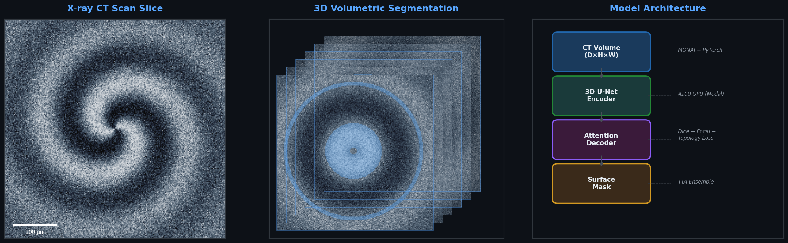
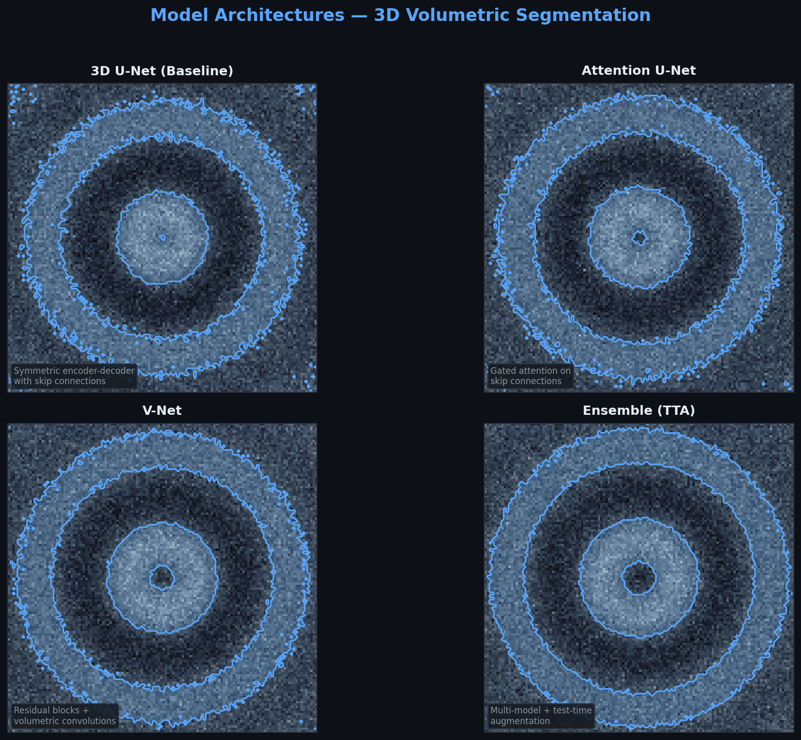
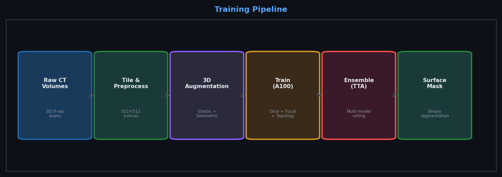

# Vesuvius Challenge — 3D Surface Detection

<p align="center">
  
</p>

Deep learning solution for detecting ancient papyrus surfaces from 3D X-ray CT scans of carbonized Herculaneum scrolls. Built with PyTorch, MONAI, and trained on A100 GPUs via Modal.

**Competition:** [Kaggle — Vesuvius Challenge Surface Detection](https://www.kaggle.com/competitions/vesuvius-challenge-surface-detection)

## The Problem

Carbonized papyrus scrolls from Herculaneum (buried by Mt. Vesuvius in 79 AD) are too fragile to unroll. High-resolution 3D X-ray CT scans can reveal the internal structure — but detecting the actual papyrus surfaces within the volume is a 3D segmentation challenge requiring topology-aware models.

## Architecture

<p align="center">
  
</p>

Four model architectures, all operating on 3D volumetric data:

| Model | Approach | Key Feature |
|-------|----------|-------------|
| **3D U-Net** | Symmetric encoder-decoder | Skip connections for fine detail |
| **Attention U-Net** | Gated attention gates | Focuses on salient regions |
| **V-Net** | Residual volumetric blocks | Dice-based training objective |
| **Double U-Net** | Stacked architecture | Two-stage refinement |

Final predictions use **ensemble + test-time augmentation** (flips, rotations) for robust surface detection.

## Training Pipeline

<p align="center">
  
</p>

### Loss Function

Custom `TopologyAwareLoss` combining three components:

```python
loss = α · DiceLoss + β · FocalLoss + γ · BoundaryLoss
# α=0.5, β=0.3, γ=0.2
```

- **Dice Loss** — Overall segmentation quality
- **Focal Loss** — Hard example mining (γ=2.0)
- **Boundary Loss** — Surface edge accuracy (topology-aware)

## Key Discovery

This is a **3D volumetric** segmentation task, not 2D surface detection:

```
Cross-section of papyrus scroll:
    ╱╲╱╲╱╲╱╲╱╲╱╲    ← Multiple wrapped layers
   ╱  ╲  ╱  ╲  ╱  ╲   
  ╱    ╲╱    ╲╱    ╲  ← Each layer = papyrus surface
 ╱                  ╲
```

In a 3D chunk, papyrus can occupy **40–96% of voxels** — high coverage predictions are correct, not corrupted.

## Quick Start

### Local Setup

```bash
git clone https://github.com/Jonathan-321/vesuviusChallenge.git
cd vesuviusChallenge

python3 -m venv venv && source venv/bin/activate
pip install -r requirements.txt

# Download competition data
kaggle competitions download -c vesuvius-challenge-surface-detection
unzip vesuvius-challenge-surface-detection.zip -d data/raw/

python scripts/preprocessing/prepare_data.py
```

### Train on Modal (A100)

```bash
bash scripts/upload_to_modal.sh        # Upload data (one time)
modal run modal_training.py --command train     # Single model
modal run modal_training.py --command parallel  # Multi-model
```

## Project Structure

```
vesuviusChallenge/
├── vesuvius-competition/
│   ├── src/
│   │   ├── training/        # Trainer, losses (TopologyAwareLoss)
│   │   ├── inference/       # Prediction + submission generation
│   │   └── evaluation/      # Metrics (Dice, IoU)
│   ├── configs/
│   │   ├── base/            # Default hyperparameters
│   │   └── experiments/     # Per-model configs
│   ├── scripts/             # Preprocessing, validation sweeps
│   └── notebooks/           # Kaggle inference notebooks
├── scripts/cluster/         # Cloud training orchestration
└── images/                  # README visuals
```

## Tech Stack

| Component | Tool |
|-----------|------|
| Framework | PyTorch + MONAI |
| Training | Modal (A100 GPUs) |
| Architectures | 3D U-Net, Attention U-Net, V-Net, Double U-Net |
| Augmentation | Albumentations (elastic, geometric, intensity) |
| Loss | Dice + Focal + Topology-Aware |
| Strategy | Ensemble + Test-Time Augmentation |

## Author

**Jonathan Muhire** — [jonathanmuhire.com](https://jonathanmuhire.com) · [GitHub](https://github.com/Jonathan-321)
